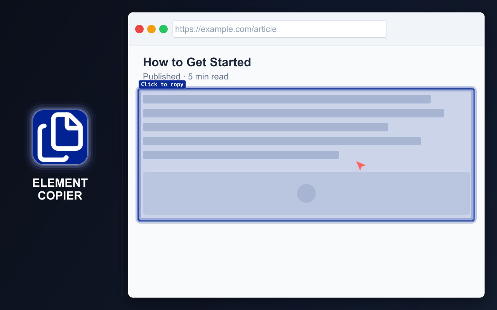
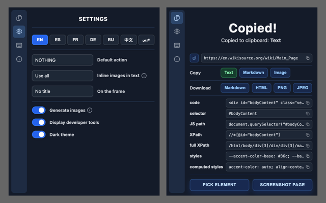
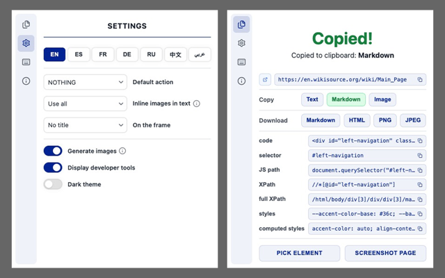

# ELEMENT COPIER

  <a href="https://chromewebstore.google.com/detail/element-copier/gdcdnijkedjdjighmalgialikcgkibel">
    <picture>
      <source media="(prefers-color-scheme: dark)" srcset="https://shieldcn.dev/badge/Chrome%20Web%20Store.svg?logo=googlechrome&logoColor=4285F4&mode=dark">
      <source media="(prefers-color-scheme: light)" srcset="https://shieldcn.dev/badge/Chrome%20Web%20Store.svg?logo=googlechrome&logoColor=4285F4&mode=light">
      
    </picture>
  </a>
  <a href="https://addons.mozilla.org/firefox/addon/element-copier/">
    <picture>
      <source media="(prefers-color-scheme: dark)" srcset="https://shieldcn.dev/badge/Firefox%20Add%E2%80%91ons.svg?logo=firefoxbrowser&logoColor=FF7139&mode=dark">
      <source media="(prefers-color-scheme: light)" srcset="https://shieldcn.dev/badge/Firefox%20Add%E2%80%91ons.svg?logo=firefoxbrowser&logoColor=FF7139&mode=light">
      
    </picture>
  </a>
  <a href="https://github.com/md2it/element-copier/releases/latest/download/element-copier.zip">
    <picture>
      <source media="(prefers-color-scheme: dark)" srcset="https://shieldcn.dev/badge/Latest%20Release%20ZIP.svg?logo=lu:FileArchive&logoColor=CA8A04&mode=dark">
      <source media="(prefers-color-scheme: light)" srcset="https://shieldcn.dev/badge/Latest%20Release%20ZIP.svg?logo=lu:FileArchive&logoColor=CA8A04&mode=light">
      
    </picture>
  </a>

=-=-=-=-=-=-=-=-= | <a href="./docs/readmes/DE.md">DE</a> | EN | <a href="./docs/readmes/ES.md">ES</a> | <a href="./docs/readmes/FR.md">FR</a> | <a href="./docs/readmes/RU.md">RU</a> | <a href="./docs/readmes/ZH.md">中文</a> | <a href="./docs/readmes/AR.md">عربي</a> | =-=-=-=-=-=-=-=-=

## DESCRIPTION

Copy and download entire pages or individual elements as rich text, images, and Markdown.

For developers and testers: URLs, HTML code, tag#id.class, CSS selectors, JS paths, XPath and full XPath, declared and computed styles, and bug-report details.

  
  
  

## KEY FEATURES

- Copy an entire page or a specific element
- Convert content into multiple formats at once
- Keep the latest copied content for all enabled formats
- Copy content to the clipboard or download it as a file
- Use a configurable default action for faster repeated copying
- Keyboard shortcuts
- Light and dark themes
- Flexible settings
- Interface available in English, French, German, Spanish, Russian, Arabic, and Simplified Chinese

### Supported formats

- Rich text for pasting into Google Docs and Word
- Images:
   - PNG
   - JPEG
- Markdown
- HTML
- Developer and testing formats:
   - Tag#id.class
   - Selector
   - JS path
   - XPath
   - Full XPath
   - Declared styles
   - Computed styles
   - QA details for bug reports

### Product notes

- Rich-text formatting is designed to produce a better result than basic copy and paste
- Keyboard shortcuts combined with a default action reduce the number of steps for repeated copying
- Developer formats make common inspection data available without opening DevTools
- Markdown processing preserves layout, links, and content images where possible, including converted SVG images

## PRIVACY

- No data collection
- No tracking
- No network requests
- Page content is processed locally in the browser

## LIMITATIONS

- **Iframe selection differs** from the selection of other elements:
   - The iframe is selected as a whole
      - This is due to a platform limitation
      - Injecting into the iframe itself is considered undesirable
   - The selection looks visually different
      - This is due to different event handlers
      - It does not affect functionality
      - Unifying the selection would provide no functional benefit
- **Large pages may take some time to process:**
   - Processing speed is limited by third-party libraries
   - The libraries are used unchanged through a wrapper
   - This is an intentional design decision
   - Image generation and saving can be disabled in settings
   - Without image processing, even very large pages are processed in a fraction of a second
- **Opening the result popup may be interrupted:**
   - The browser may open another popup with a higher priority
   - This does not affect extension functionality
   - Processes already started will still be completed
- **Small-image handling in Markdown is optional:**
   - Some use cases require collecting all small images
   - Other use cases require excluding them
   - The extension cannot predict the user's goal
   - This behavior is controlled by a separate setting

## LICENSE

[MIT License](./LICENSE)
