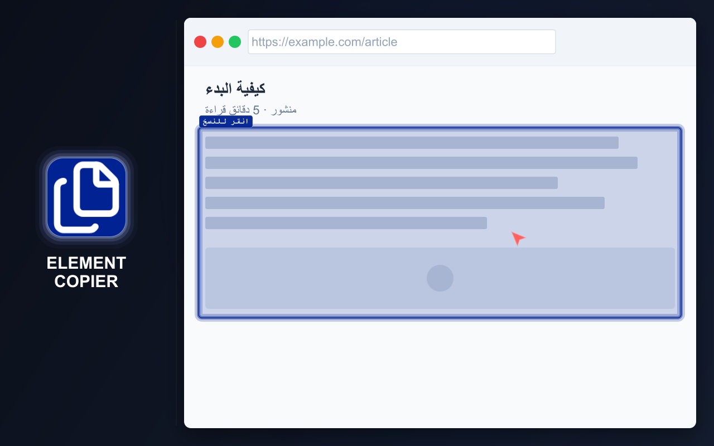

# ELEMENT COPIER

=-=-=-=-=-=-=-=-= | <a href="./DE.md">DE</a> | <a href="../../README.md">EN</a> | <a href="./ES.md">ES</a> | <a href="./FR.md">FR</a> | <a href="./RU.md">RU</a> | <a href="./ZH.md">中文</a> | عربي | =-=-=-=-=-=-=-=-=

  

## التثبيت

### المتاجر

- Chrome https://chromewebstore.google.com/detail/element-copier/gdcdnijkedjdjighmalgialikcgkibel
- Firefox https://addons.mozilla.org/firefox/addon/element-copier/ (قيد المراجعة)

### وضع التطوير

حمّل مجلد [`extension`](../../extension) بالكامل كإضافة غير مضغوطة.

## الوصف

انسخ محتوى صفحات الويب ونزّله بسرعة وبتنسيق مناسب.

يستطيع Element Copier معالجة صفحة كاملة أو عنصر محدد وإعداد النتيجة بعدة تنسيقات في الوقت نفسه. يظل آخر محتوى منسوخ متاحًا لكل تنسيق مفعّل.

## الميزات الرئيسية

- نسخ صفحة كاملة أو عنصر محدد
- تحويل المحتوى إلى عدة تنسيقات في الوقت نفسه
- الاحتفاظ بآخر محتوى منسوخ لجميع التنسيقات المفعّلة
- نسخ المحتوى إلى الحافظة أو تنزيله كملف
- استخدام إجراء افتراضي قابل للتخصيص لتسريع عمليات النسخ المتكررة
- اختصارات لوحة المفاتيح
- سمة فاتحة وأخرى داكنة
- إعدادات مرنة

## الخصوصية

- لا يتم جمع البيانات
- لا يوجد تتبع
- لا توجد طلبات شبكة
- تتم معالجة محتوى الصفحة محليًا في المتصفح

## التنسيقات المدعومة

- نص منسق للصق في Google Docs وWord
- الصور:
   - PNG
   - JPEG
- Markdown
- HTML
- تنسيقات التطوير والاختبار:
   - Selector
   - مسار JS
   - XPath
   - XPath كامل
   - الأنماط المعلنة
   - الأنماط المحسوبة

## لغات الواجهة

- الإنجليزية
- الروسية
- الإسبانية
- الفرنسية
- الألمانية
- الصينية المبسطة
- العربية

## الاستخدام

U = المستخدم
E = الإضافة

1. يشغّل U الإضافة E بالنقر على زرها في شريط أدوات المتصفح
2. تفتح E نافذة:
   - إذا كانت ذاكرة التخزين المؤقت فارغة، تفتح E نافذة START
   - إذا لم تكن فارغة، تفتح E نافذة COPIED
3. ينقر U على START أو START OVER
4. يمرر U المؤشر فوق عنصر
5. تميّز E العنصر
6. ينقر U على العنصر
7. تنفذ E جميع الإجراءات التالية:
   - تحفظ البيانات وفقًا للإعدادات
   - تفتح نافذة تعرض معلومات عن النتيجة
   - توقف وضع تحديد العناصر

راجع [جميع مسارات المستخدم](../spec/user-path.md) لمعرفة اختصارات لوحة المفاتيح وسلوك ذاكرة التخزين المؤقت ونسخ النص المنسق والإجراءات المتاحة للمحتوى المنسوخ.

## ملاحظات المنتج

- صُمم تنسيق النص المنسق لتقديم نتيجة أفضل من النسخ واللصق الأساسيين
- تقلل اختصارات لوحة المفاتيح والإجراء الافتراضي عدد الخطوات في عمليات النسخ المتكررة
- تتيح تنسيقات المطورين بيانات الفحص الشائعة دون فتح DevTools
- تحافظ معالجة Markdown قدر الإمكان على التخطيط والروابط وصور المحتوى، بما فيها صور SVG المحوّلة

## القيود

- **يختلف تحديد iframe** عن تحديد العناصر الأخرى:
   - يتم تحديد iframe بالكامل
   - يرجع ذلك إلى قيد في المنصة، ولا يُنصح بالحقن داخل iframe
   - يبدو التحديد مختلفًا بسبب اختلاف معالجات الأحداث، لكنه لا يؤثر في الوظائف
- **قد تستغرق معالجة الصفحات الكبيرة بعض الوقت:**
   - تحد مكتبات الجهات الخارجية المستخدمة دون تعديل من سرعة المعالجة
   - يمكن تعطيل إنشاء الصور وحفظها من الإعدادات
   - من دون معالجة الصور، تتم معالجة الصفحات الكبيرة جدًا في جزء من الثانية
- **قد تتم مقاطعة فتح نافذة النتائج المنبثقة:**
   - قد يفتح المتصفح نافذة منبثقة أخرى ذات أولوية أعلى
   - ستكتمل العمليات التي بدأت بالفعل
- **معالجة الصور الصغيرة في Markdown اختيارية:**
   - تتطلب بعض حالات الاستخدام تضمينها، بينما تتطلب حالات أخرى استبعادها
   - يتم التحكم في هذا السلوك من خلال إعداد مستقل

## الترخيص

[ترخيص MIT](../../LICENSE)
