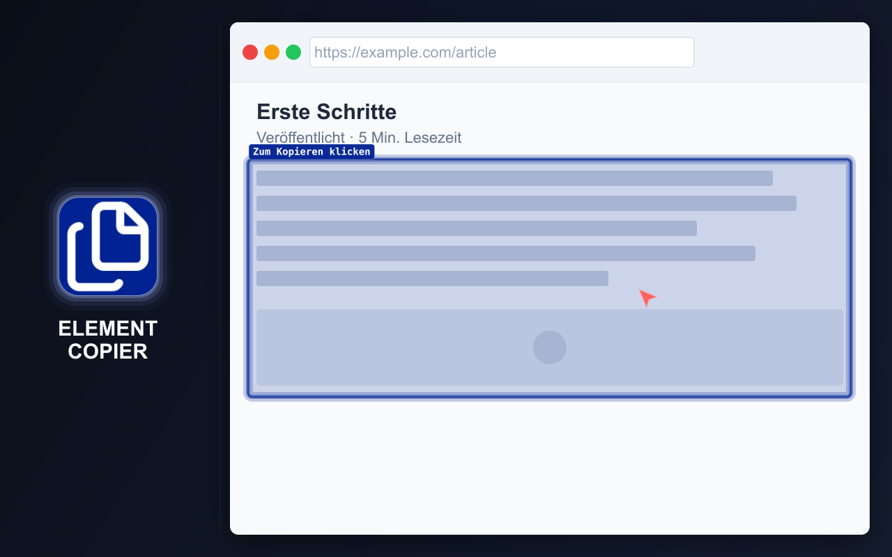

# ELEMENT COPIER

=-=-=-=-=-=-=-=-= | DE | <a href="../../README.md">EN</a> | <a href="./ES.md">ES</a> | <a href="./FR.md">FR</a> | <a href="./RU.md">RU</a> | <a href="./ZH.md">中文</a> | <a href="./AR.md">عربي</a> | =-=-=-=-=-=-=-=-=

## BESCHREIBUNG

Kopieren und laden Sie Inhalte von Webseiten schnell in einem praktischen Format herunter.

Element Copier kann eine ganze Seite oder ein bestimmtes Element verarbeiten und das Ergebnis gleichzeitig in mehreren Formaten erstellen. Der zuletzt kopierte Inhalt bleibt für jedes aktivierte Format verfügbar.

  

## INSTALLATION

### Stores

- [Chrome Web Store](https://chromewebstore.google.com/detail/element-copier/gdcdnijkedjdjighmalgialikcgkibel)
- [Firefox Add-ons](https://addons.mozilla.org/firefox/addon/element-copier/)

### Manuelle Installation

- **GitHub Release.** Laden Sie das aktuelle Release-ZIP für die lokale Installation herunter:
  [element-copier.zip](https://github.com/md2it/element-copier/releases/latest/download/element-copier.zip)

  Entpacken Sie das Archiv und laden Sie den Ordner als entpackte Erweiterung.

- **Entwicklungsmodus.** Laden Sie das gesamte Verzeichnis [`extension`](../../extension) als entpackte Erweiterung.

## HAUPTFUNKTIONEN

- Ganze Seite oder bestimmtes Element kopieren
- Inhalte gleichzeitig in mehrere Formate konvertieren
- Zuletzt kopierte Inhalte für alle aktivierten Formate speichern
- Inhalte in die Zwischenablage kopieren oder als Datei herunterladen
- Konfigurierbare Standardaktion für schnelleres wiederholtes Kopieren
- Tastaturkürzel
- Helles und dunkles Design
- Flexible Einstellungen

### Unterstützte Formate

- Rich Text zum Einfügen in Google Docs und Word
- Bilder:
   - PNG
   - JPEG
- Markdown
- HTML
- Entwickler- und Testformate:
   - Tag#id.class
   - Selektor
   - JS-Pfad
   - XPath
   - Vollständiger XPath
   - Deklarierte Stile
   - Berechnete Stile
   - QA-Details für Fehlerberichte

### Produkthinweise

- Die Rich-Text-Formatierung liefert bessere Ergebnisse als einfaches Kopieren und Einfügen
- Tastaturkürzel und eine Standardaktion reduzieren die Anzahl der Schritte bei wiederholtem Kopieren
- Entwicklerformate stellen häufig benötigte Prüfdaten ohne DevTools bereit
- Die Markdown-Verarbeitung bewahrt nach Möglichkeit Layout, Links und Inhaltsbilder, einschließlich konvertierter SVG-Bilder

## VERWENDUNG

U = Benutzer
E = Erweiterung

1. U startet E über die Schaltfläche in der Browser-Symbolleiste
2. E öffnet ein Fenster:
   - Bei leerem Cache öffnet E das START-Fenster
   - Bei nicht leerem Cache öffnet E das COPIED-Fenster
3. U klickt auf START oder START OVER
4. U bewegt den Mauszeiger über ein Element
5. E hebt das Element hervor
6. U klickt auf das Element
7. E führt alle folgenden Aktionen aus:
   - Speichert Daten gemäß den Einstellungen
   - Öffnet ein Fenster mit Informationen zum Ergebnis
   - Beendet den Elementauswahlmodus

Weitere Informationen zu Tastaturkürzeln, Cache-Verhalten, Rich-Text-Kopieren und Aktionen mit kopierten Inhalten finden Sie unter [alle Benutzerpfade](../spec/user-path.md).

## EINSCHRÄNKUNGEN

- **Die Auswahl von Iframes unterscheidet sich** von der Auswahl anderer Elemente:
   - Das Iframe wird als Ganzes ausgewählt
   - Ursache ist eine Plattformbeschränkung; eine Injektion in das Iframe ist unerwünscht
   - Die Auswahl sieht wegen anderer Ereignishandler anders aus, ohne die Funktion zu beeinträchtigen
- **Die Verarbeitung großer Seiten kann einige Zeit dauern:**
   - Die Geschwindigkeit wird durch unverändert verwendete Drittanbieterbibliotheken begrenzt
   - Bilderzeugung und -speicherung können in den Einstellungen deaktiviert werden
   - Ohne Bildverarbeitung werden selbst sehr große Seiten in Sekundenbruchteilen verarbeitet
- **Das Öffnen des Ergebnis-Pop-ups kann unterbrochen werden:**
   - Der Browser kann ein anderes Pop-up mit höherer Priorität öffnen
   - Bereits gestartete Prozesse werden trotzdem abgeschlossen
- **Die Behandlung kleiner Bilder in Markdown ist optional:**
   - Je nach Anwendungsfall sollen kleine Bilder einbezogen oder ausgeschlossen werden
   - Dieses Verhalten wird über eine separate Einstellung gesteuert

## DATENSCHUTZ

- Keine Datenerfassung
- Kein Tracking
- Keine Netzwerkanfragen
- Seiteninhalte werden lokal im Browser verarbeitet

## OBERFLÄCHENSPRACHEN

- Englisch
- Französisch
- Deutsch
- Spanisch
- Russisch
- Arabisch
- Vereinfachtes Chinesisch

## LIZENZ

[MIT-Lizenz](../../LICENSE)
