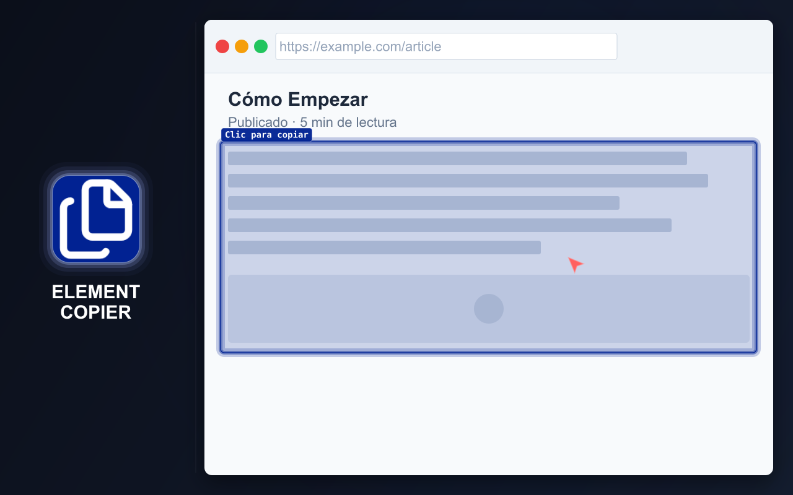

# ELEMENT COPIER

  <a href="https://chromewebstore.google.com/detail/element-copier/gdcdnijkedjdjighmalgialikcgkibel" target="_blank" rel="noopener noreferrer">
    <picture>
      <source media="(prefers-color-scheme: dark)" srcset="https://shieldcn.dev/badge/Chrome%20Web%20Store.svg?logo=googlechrome&logoColor=4285F4&mode=dark">
      <source media="(prefers-color-scheme: light)" srcset="https://shieldcn.dev/badge/Chrome%20Web%20Store.svg?logo=googlechrome&logoColor=4285F4&mode=light">
      
    </picture>
  </a>
  <a href="https://addons.mozilla.org/firefox/addon/element-copier/" target="_blank" rel="noopener noreferrer">
    <picture>
      <source media="(prefers-color-scheme: dark)" srcset="https://shieldcn.dev/badge/Firefox%20Add%E2%80%91ons.svg?logo=firefoxbrowser&logoColor=FF7139&mode=dark">
      <source media="(prefers-color-scheme: light)" srcset="https://shieldcn.dev/badge/Firefox%20Add%E2%80%91ons.svg?logo=firefoxbrowser&logoColor=FF7139&mode=light">
      
    </picture>
  </a>
  <a href="https://github.com/md2it/element-copier/releases/latest/download/element-copier.zip">
    <picture>
      <source media="(prefers-color-scheme: dark)" srcset="https://shieldcn.dev/badge/Latest%20Release%20ZIP.svg?logo=lu:FileArchive&logoColor=CA8A04&mode=dark">
      <source media="(prefers-color-scheme: light)" srcset="https://shieldcn.dev/badge/Latest%20Release%20ZIP.svg?logo=lu:FileArchive&logoColor=CA8A04&mode=light">
      
    </picture>
  </a>

=-=-=-=-=-=-=-=-= | <a href="./DE.md">DE</a> | <a href="../../README.md">EN</a> | ES | <a href="./FR.md">FR</a> | <a href="./RU.md">RU</a> | <a href="./ZH.md">中文</a> | <a href="./AR.md">عربي</a> | =-=-=-=-=-=-=-=-=

## DESCRIPCIÓN

Copie y descargue páginas completas o elementos individuales como texto con formato, imágenes y Markdown.

Para desarrolladores y testers: URL, código HTML, tag#id.class, selectores CSS, rutas JS, XPath y XPath completo, estilos declarados y calculados, y datos para informes de errores.

  

## FUNCIONES PRINCIPALES

- Copiar una página completa o un elemento específico
- Convertir contenido a varios formatos a la vez
- Conservar el último contenido copiado para todos los formatos habilitados
- Copiar contenido al portapapeles o descargarlo como archivo
- Usar una acción predeterminada configurable para acelerar las copias repetidas
- Atajos de teclado
- Temas claro y oscuro
- Configuración flexible
- Interfaz disponible en inglés, francés, alemán, español, ruso, árabe y chino simplificado

### Formatos compatibles

- Texto enriquecido para pegar en Google Docs y Word
- Imágenes:
   - PNG
   - JPEG
- Markdown
- HTML
- Formatos para desarrollo y pruebas:
   - Tag#id.class
   - Selector
   - Ruta JS
   - XPath
   - XPath completo
   - Estilos declarados
   - Estilos calculados
   - Detalles de QA para informes de errores

### Notas del producto

- El formato de texto enriquecido está diseñado para ofrecer un resultado mejor que copiar y pegar de forma básica
- Los atajos de teclado y una acción predeterminada reducen los pasos de las copias repetidas
- Los formatos para desarrolladores ofrecen datos de inspección habituales sin abrir DevTools
- El procesamiento de Markdown conserva, cuando es posible, el diseño, los enlaces y las imágenes del contenido, incluidas las imágenes SVG convertidas

## PRIVACIDAD

- No se recopilan datos
- Sin seguimiento
- Sin solicitudes de red
- El contenido de la página se procesa localmente en el navegador

## LIMITACIONES

- **La selección de iframes es diferente** a la de otros elementos:
   - El iframe se selecciona como un todo
      - Esto se debe a una limitación de la plataforma
      - Inyectar código dentro del propio iframe se considera indeseable
   - La selección se ve diferente visualmente
      - Esto se debe a otros controladores de eventos
      - No afecta a la funcionalidad
      - Unificar la selección no aportaría ningún beneficio funcional
- **Las páginas grandes pueden tardar en procesarse:**
   - La velocidad de procesamiento está limitada por bibliotecas de terceros
   - Las bibliotecas se usan sin modificaciones, a través de un wrapper
   - Esto es una decisión de diseño intencionada
   - La generación y el guardado de imágenes se pueden desactivar en la configuración
   - Sin procesamiento de imágenes, incluso las páginas muy grandes se procesan en una fracción de segundo
- **La apertura de la ventana emergente de resultados puede interrumpirse:**
   - El navegador puede abrir otra ventana emergente con mayor prioridad
   - Esto no afecta a la funcionalidad de la extensión
   - Los procesos ya iniciados se completarán
- **El tratamiento de imágenes pequeñas en Markdown es opcional:**
   - Algunos casos de uso requieren recopilar todas las imágenes pequeñas
   - Otros casos de uso requieren excluirlas
   - La extensión no puede predecir el objetivo del usuario
   - Este comportamiento se controla mediante una configuración independiente

## LICENCIA

[Licencia MIT](../../LICENSE)
