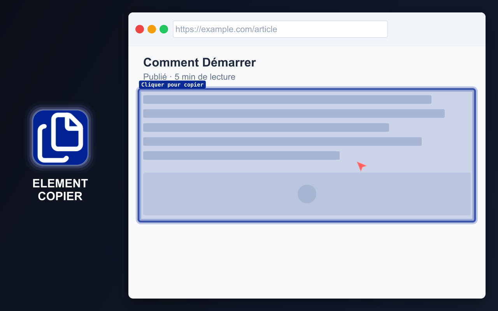

# ELEMENT COPIER

=-=-=-=-=-=-=-=-= | <a href="./DE.md">DE</a> | <a href="../../README.md">EN</a> | <a href="./ES.md">ES</a> | FR | <a href="./RU.md">RU</a> | <a href="./ZH.md">中文</a> | <a href="./AR.md">عربي</a> | =-=-=-=-=-=-=-=-=

## DESCRIPTION

Copiez et téléchargez rapidement le contenu de pages web dans un format pratique.

Element Copier peut traiter une page entière ou un élément précis et préparer simultanément le résultat dans plusieurs formats. Le dernier contenu copié reste disponible pour chaque format activé.

  

## INSTALLATION

### Boutiques

- Chrome https://chromewebstore.google.com/detail/element-copier/gdcdnijkedjdjighmalgialikcgkibel
- Firefox https://addons.mozilla.org/firefox/addon/element-copier/ (en cours de modération)

### Installation manuelle

- **GitHub Release.** Téléchargez le ZIP de la dernière version pour une installation locale :
  [element-copier.zip](https://github.com/md2it/element-copier/releases/latest/download/element-copier.zip)

  Décompressez l'archive et chargez le dossier comme extension non empaquetée.

- **Mode développement.** Chargez l'intégralité du répertoire [`extension`](../../extension) comme extension non empaquetée.

## FONCTIONNALITÉS PRINCIPALES

- Copier une page entière ou un élément précis
- Convertir le contenu dans plusieurs formats à la fois
- Conserver le dernier contenu copié pour tous les formats activés
- Copier le contenu dans le presse-papiers ou le télécharger sous forme de fichier
- Utiliser une action par défaut configurable pour accélérer les copies répétées
- Raccourcis clavier
- Thèmes clair et sombre
- Paramètres flexibles

### Formats pris en charge

- Texte enrichi à coller dans Google Docs et Word
- Images :
   - PNG
   - JPEG
- Markdown
- HTML
- Formats de développement et de test :
   - Tag#id.class
   - Sélecteur
   - Chemin JS
   - XPath
   - XPath complet
   - Styles déclarés
   - Styles calculés

### Notes sur le produit

- La mise en forme du texte enrichi vise un meilleur résultat qu'un simple copier-coller
- Les raccourcis clavier et une action par défaut réduisent le nombre d'étapes pour les copies répétées
- Les formats destinés aux développeurs fournissent des données d'inspection courantes sans ouvrir les DevTools
- Le traitement Markdown préserve autant que possible la mise en page, les liens et les images du contenu, y compris les images SVG converties

## UTILISATION

U = Utilisateur
E = Extension

1. U lance E en cliquant sur son bouton dans la barre d'outils du navigateur
2. E ouvre une fenêtre :
   - Si le cache est vide, E ouvre la fenêtre START
   - Si le cache n'est pas vide, E ouvre la fenêtre COPIED
3. U clique sur START ou START OVER
4. U survole un élément
5. E met l'élément en évidence
6. U clique sur l'élément
7. E effectue toutes les actions suivantes :
   - Enregistre les données conformément aux paramètres
   - Ouvre une fenêtre contenant des informations sur le résultat
   - Arrête le mode de sélection d'élément

Consultez [tous les parcours utilisateur](../spec/user-path.md) pour les raccourcis clavier, le fonctionnement du cache, la copie de texte enrichi et les actions sur le contenu copié.

## LIMITATIONS

- **La sélection d'une iframe diffère** de celle des autres éléments :
   - L'iframe est sélectionnée dans son ensemble
   - Cette différence vient d'une limitation de la plateforme ; l'injection dans l'iframe n'est pas souhaitable
   - La sélection a un aspect différent en raison de gestionnaires d'événements distincts, sans incidence fonctionnelle
- **Le traitement des pages volumineuses peut prendre du temps :**
   - La vitesse est limitée par des bibliothèques tierces utilisées sans modification
   - La génération et l'enregistrement des images peuvent être désactivés dans les paramètres
   - Sans traitement d'images, même les pages très volumineuses sont traitées en une fraction de seconde
- **L'ouverture de la fenêtre de résultat peut être interrompue :**
   - Le navigateur peut ouvrir une autre fenêtre prioritaire
   - Les processus déjà lancés seront tout de même terminés
- **La gestion des petites images dans Markdown est facultative :**
   - Certains usages nécessitent de les inclure, d'autres de les exclure
   - Ce comportement est contrôlé par un paramètre distinct

## CONFIDENTIALITÉ

- Aucune collecte de données
- Aucun suivi
- Aucune requête réseau
- Le contenu des pages est traité localement dans le navigateur

## LANGUES DE L'INTERFACE

- Anglais
- Français
- Allemand
- Espagnol
- Russe
- Arabe
- Chinois simplifié

## LICENCE

[Licence MIT](../../LICENSE)
