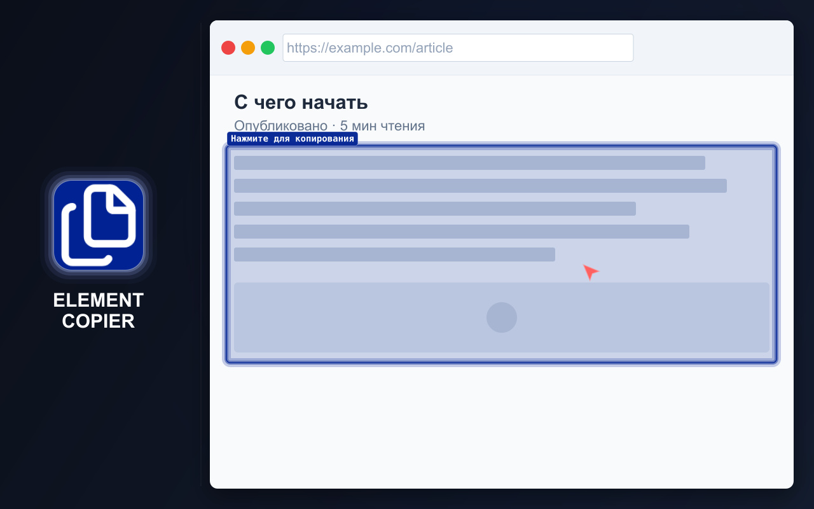
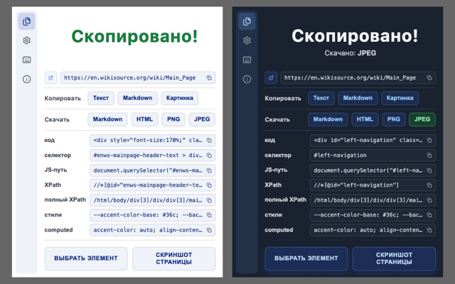
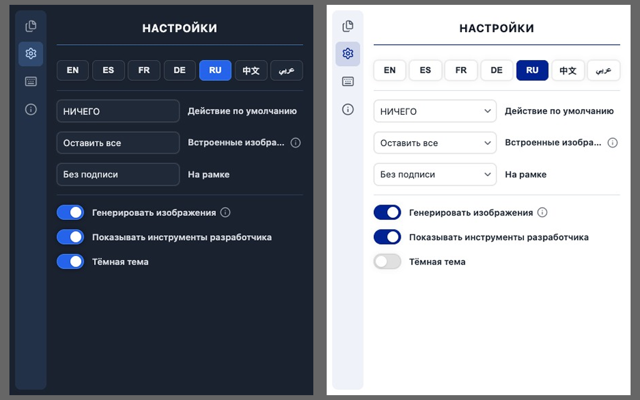

# ELEMENT COPIER

  <a href="https://chromewebstore.google.com/detail/element-copier/gdcdnijkedjdjighmalgialikcgkibel" target="_blank" rel="noopener noreferrer">
    <picture>
      <source media="(prefers-color-scheme: dark)" srcset="https://shieldcn.dev/badge/%D0%98%D0%BD%D1%82%D0%B5%D1%80%D0%BD%D0%B5%D1%82%E2%80%91%D0%BC%D0%B0%D0%B3%D0%B0%D0%B7%D0%B8%D0%BD%20Chrome.svg?logo=googlechrome&logoColor=4285F4&mode=dark">
      <source media="(prefers-color-scheme: light)" srcset="https://shieldcn.dev/badge/%D0%98%D0%BD%D1%82%D0%B5%D1%80%D0%BD%D0%B5%D1%82%E2%80%91%D0%BC%D0%B0%D0%B3%D0%B0%D0%B7%D0%B8%D0%BD%20Chrome.svg?logo=googlechrome&logoColor=4285F4&mode=light">
      
    </picture>
  </a>
  <a href="https://addons.mozilla.org/firefox/addon/element-copier/" target="_blank" rel="noopener noreferrer">
    <picture>
      <source media="(prefers-color-scheme: dark)" srcset="https://shieldcn.dev/badge/%D0%94%D0%BE%D0%BF%D0%BE%D0%BB%D0%BD%D0%B5%D0%BD%D0%B8%D1%8F%20Firefox.svg?logo=firefoxbrowser&logoColor=FF7139&mode=dark">
      <source media="(prefers-color-scheme: light)" srcset="https://shieldcn.dev/badge/%D0%94%D0%BE%D0%BF%D0%BE%D0%BB%D0%BD%D0%B5%D0%BD%D0%B8%D1%8F%20Firefox.svg?logo=firefoxbrowser&logoColor=FF7139&mode=light">
      
    </picture>
  </a>
  <a href="https://github.com/md2it/element-copier/releases/latest/download/element-copier.zip">
    <picture>
      <source media="(prefers-color-scheme: dark)" srcset="https://shieldcn.dev/badge/%D0%9F%D0%BE%D1%81%D0%BB%D0%B5%D0%B4%D0%BD%D0%B8%D0%B9%20%D1%80%D0%B5%D0%BB%D0%B8%D0%B7%20(ZIP).svg?logo=lu:FileArchive&logoColor=CA8A04&mode=dark">
      <source media="(prefers-color-scheme: light)" srcset="https://shieldcn.dev/badge/%D0%9F%D0%BE%D1%81%D0%BB%D0%B5%D0%B4%D0%BD%D0%B8%D0%B9%20%D1%80%D0%B5%D0%BB%D0%B8%D0%B7%20(ZIP).svg?logo=lu:FileArchive&logoColor=CA8A04&mode=light">
      
    </picture>
  </a>

=-=-=-=-=-=-=-=-= | <a href="./DE.md">DE</a> | <a href="../../README.md">EN</a> | <a href="./ES.md">ES</a> | <a href="./FR.md">FR</a> | RU | <a href="./ZH.md">中文</a> | <a href="./AR.md">عربي</a> | =-=-=-=-=-=-=-=-=

## ОПИСАНИЕ

Копируйте и скачивайте всю страницу или её элементы как форматированный текст, изображения и Markdown.

Для разработчиков и тестировщиков: URL, HTML-код, tag#id.class, CSS-селекторы, JS path, XPath и полный XPath, объявленные и вычисленные стили, а также данные для баг-репортов.

  
  
  

## КЛЮЧЕВЫЕ ВОЗМОЖНОСТИ

- Копирование всей страницы или отдельного элемента
- Преобразование содержимого сразу в несколько форматов
- Хранение последнего скопированного содержимого для всех включённых форматов
- Копирование в буфер обмена или скачивание в виде файла
- Настраиваемое действие по умолчанию для ускорения повторных операций
- Горячие клавиши
- Светлая и тёмная темы
- Гибкие настройки
- Интерфейс доступен на английском, французском, немецком, испанском, русском, арабском и упрощённом китайском языках

### Поддерживаемые форматы

- Форматированный текст для вставки в Google Docs и Word
- Изображения:
   - PNG
   - JPEG
- Markdown
- HTML
- Форматы для разработки и тестирования:
   - Tag#id.class
   - Селектор
   - JS path
   - XPath
   - Full XPath
   - Объявленные стили
   - Вычисленные стили
   - QA details для баг-репортов

### Примечания о продукте

- Форматирование текста рассчитано на лучший результат, чем обычное копирование и вставка
- Горячие клавиши и действие по умолчанию сокращают число шагов при повторном копировании
- Форматы для разработчиков предоставляют часто используемые данные без открытия DevTools
- Обработка Markdown по возможности сохраняет структуру, ссылки и изображения, включая преобразованные SVG

## КОНФИДЕНЦИАЛЬНОСТЬ

- Данные не собираются
- Отслеживание отсутствует
- Сетевые запросы отсутствуют
- Содержимое страницы обрабатывается локально в браузере

## ОГРАНИЧЕНИЯ

- **Выбор iframe отличается** от выбора других элементов:
   - Iframe выбирается целиком
      - Это связано с ограничением платформы
      - Внедрение непосредственно в iframe считается нежелательным
   - Выделение выглядит визуально иначе
      - Это связано с другими обработчиками событий
      - Это не влияет на функциональность
      - Унификация выделения не дала бы никакой функциональной пользы
- **Обработка больших страниц может занять некоторое время:**
   - Скорость обработки ограничена сторонними библиотеками
   - Библиотеки используются без изменений через обёртку
   - Это осознанное решение при разработке
   - Создание и сохранение изображений можно отключить в настройках
   - Без обработки изображений даже очень большие страницы обрабатываются за доли секунды
- **Открытие окна результата может быть прервано:**
   - Браузер может открыть другое окно с более высоким приоритетом
   - Это не влияет на работу расширения
   - Уже запущенные процессы всё равно будут завершены
- **Обработка небольших изображений в Markdown настраивается отдельно:**
   - В одних сценариях нужно собирать все маленькие изображения
   - В других сценариях их нужно исключать
   - Расширение не может предугадать цель пользователя
   - Это поведение управляется отдельной настройкой

## ЛИЦЕНЗИЯ

[Лицензия MIT](../../LICENSE)
