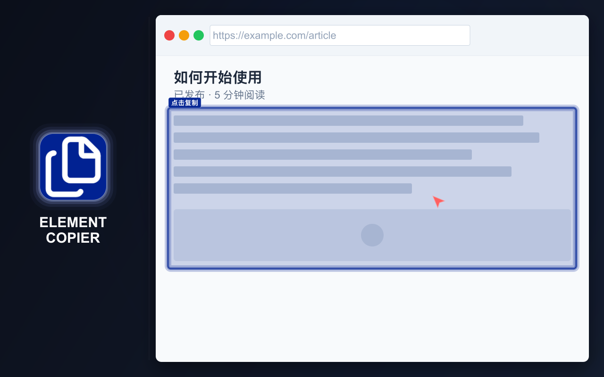
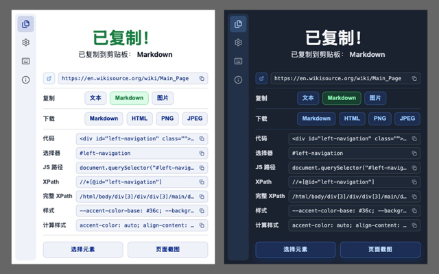
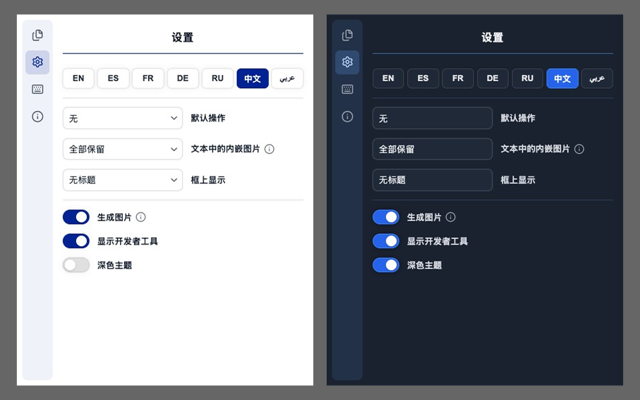

# ELEMENT COPIER

=-=-=-=-=-=-=-=-= | <a href="./DE.md">DE</a> | <a href="../../README.md">EN</a> | <a href="./ES.md">ES</a> | <a href="./FR.md">FR</a> | <a href="./RU.md">RU</a> | 中文 | <a href="./AR.md">عربي</a> | =-=-=-=-=-=-=-=-=

  
  
  

## 安装

### 扩展商店

- Chrome https://chromewebstore.google.com/detail/element-copier/gdcdnijkedjdjighmalgialikcgkibel
- Firefox https://addons.mozilla.org/firefox/addon/element-copier/ （审核中）

### 开发模式

将整个 [`extension`](../../extension) 目录作为未打包的扩展程序加载。

## 说明

快速复制和下载网页内容，并转换为方便使用的格式。

Element Copier 可以处理整个页面或指定元素，并同时生成多种格式的结果。每种已启用格式都会保留最近一次复制的内容。

## 主要功能

- 复制整个页面或指定元素
- 同时将内容转换为多种格式
- 为所有已启用格式保留最近复制的内容
- 将内容复制到剪贴板或下载为文件
- 使用可配置的默认操作加快重复复制
- 键盘快捷键
- 浅色和深色主题
- 灵活的设置

## 隐私

- 不收集数据
- 不跟踪用户
- 不发送网络请求
- 页面内容仅在浏览器本地处理

## 支持的格式

- 可粘贴到 Google Docs 和 Word 的富文本
- 图像：
   - PNG
   - JPEG
- Markdown
- HTML
- 开发和测试格式：
   - Tag#id.class
   - 选择器
   - JS 路径
   - XPath
   - 完整 XPath
   - 声明样式
   - 计算样式

## 界面语言

- 英语
- 俄语
- 西班牙语
- 法语
- 德语
- 简体中文
- 阿拉伯语

## 使用方法

U = 用户
E = 扩展程序

1. U 点击浏览器工具栏中的按钮启动 E
2. E 打开一个窗口：
   - 如果缓存为空，E 打开 START 窗口
   - 如果缓存不为空，E 打开 COPIED 窗口
3. U 点击 START 或 START OVER
4. U 将鼠标悬停在某个元素上
5. E 高亮显示该元素
6. U 点击该元素
7. E 执行以下所有操作：
   - 按照设置保存数据
   - 打开显示结果信息的窗口
   - 停止元素选择模式

有关键盘快捷键、缓存行为、富文本复制以及已复制内容的操作，请参阅[所有用户路径](../spec/user-path.md)。

## 产品说明

- 富文本格式旨在提供优于基本复制粘贴的结果
- 键盘快捷键和默认操作可减少重复复制所需的步骤
- 开发者格式无需打开 DevTools 即可提供常用检查数据
- Markdown 处理会尽可能保留布局、链接和内容图像，包括转换后的 SVG 图像

## 限制

- **iframe 的选择方式与其他元素不同：**
   - iframe 会作为一个整体被选择
   - 这是平台限制所致；不建议向 iframe 内部注入代码
   - 由于事件处理程序不同，选择效果在视觉上有所不同，但不影响功能
- **处理大型页面可能需要一些时间：**
   - 处理速度受未经修改的第三方库限制
   - 可以在设置中禁用图像生成和保存
   - 不处理图像时，即使是非常大的页面也能在不到一秒内完成处理
- **结果弹出窗口可能会被中断：**
   - 浏览器可能打开优先级更高的其他弹出窗口
   - 已启动的处理仍会完成
- **Markdown 中小图像的处理方式可以配置：**
   - 某些使用场景需要包含小图像，另一些则需要排除
   - 此行为由单独的设置控制

## 许可证

[MIT 许可证](../../LICENSE)
